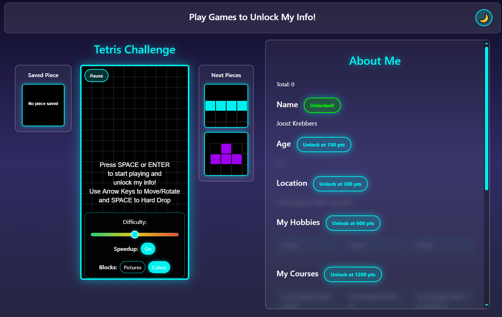
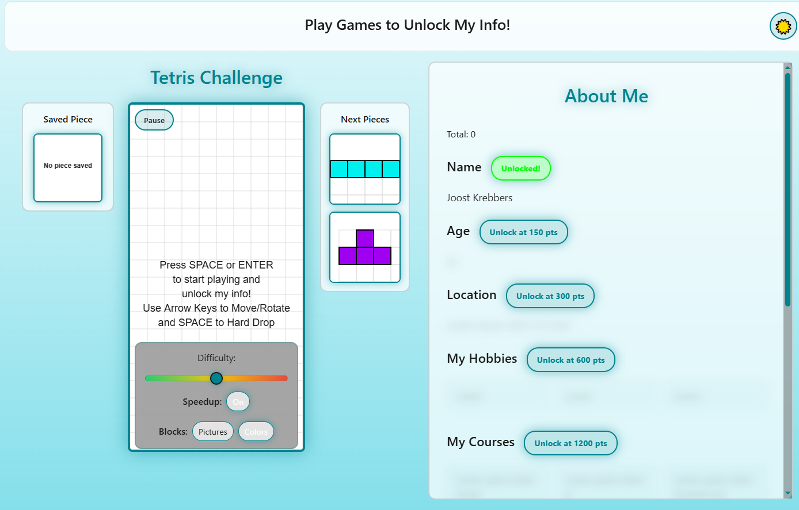
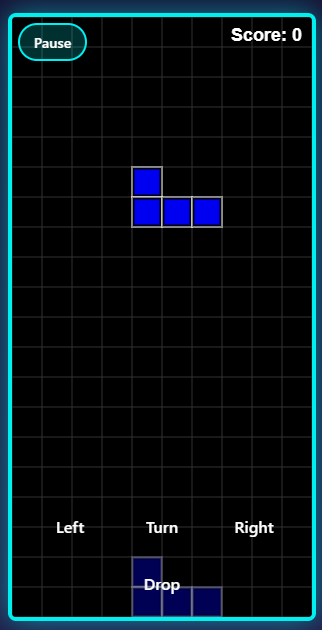

## 4 february 2026

### Things i did today

- Tetris about me functionality
- Added programming languages I like to the API and front-end
- Added more styling to the website
- Added a dark mode toggle button to the website

### time it took

- 1 hour
- 30 minutes
- 1 hour
- 2,5 hours

### What i learned

- How to make small animation with css
- How to work with variables in css
- How to make a dark mode toggle button with javascript and css

### What I want to do next

- Adding difficulty levels to the tetris game
- Adding sound effects to the tetris game
- Adding difficulty to unlock more sections based on score

## 5 february 2026

### Things i did today

- Added a difficulty slider to the tetris game
- Added audio
- Added hand held verion
- Added some fun easter eggs
- Changed api from own to school api

### time it took

- 1,5 hours
- 1 hour
- 3 hours
- 45 minutes
- 15 minutes

### What i learned

- How to make animations with css
- How to make a site both work on desktop and mobile

### What I want to do next

- Adding a second game

## 6 february 2026

### Things i did today
- Added a second game (minesweeper)
- Added a car driving
- Added a clicking on a car does something

### time it took
- 3 hours
- 1 hour
- 2 hours

### What i learned
- How to make a car drive across the screen with css and javascript

### What I want to do next
- Adding 2048 game
- Add piece saving in tetris

# Week 1 Summary (4 – 6 February 2026)

## What I Did This Week

This week I focused on improving my website and expanding my game features, mainly working on Tetris and adding new interactive elements.

### Game Development

I improved and expanded my Tetris game by:
- Adding a difficulty slider
- Adding audio and sound effects
- Creating a dark mode toggle
- Planning a piece-saving feature
- Planning a difficulty system that unlocks sections based on score

I also:
- Added a second game (Minesweeper)
- Started working on a car driving animation
- Made the car interactive when clicked
- Planned to add a 2048 game next

### Website Improvements

- Created a Tetris “About Me” functionality
- Added the programming languages I like to both the API and frontend
- Switched from my own API to the school API
- Improved the overall styling of the website
- Built a handheld/mobile version to make the site responsive
- Added some fun easter eggs

## Time Invested

In total, I spent approximately 16 hours working on development across these three days.

## What I Learned

This week I learned:
- How to create small animations with CSS
- How to work with CSS variables
- How to build a dark mode toggle using JavaScript and CSS
- How to make a website responsive for both desktop and mobile
- How to animate movement (like a car driving across the screen) using CSS and JavaScript

## What I Want to Do Next

- Add a 2048 game
- Implement piece saving in Tetris
- Expand the difficulty system
- Continue improving interactivity and features

## 9 february 2026

### Things i did today
- Added a third game (2048)
- Added piece saving in tetris
- Added a picture gallery easter egg
- Made tetris blocks pictures
- Made tetris pieces fall faster the longer you play

### time it took
- 2 hours
- 1 hour
- 1 hour
- 2 hours
- 30 minutes

### What i learned
- How to make a picture gallery with javascript and css
- How to make tetris pieces be images instead of colored blocks

### What I want to do next

- Adding a fourth game??

## 10 february 2026

### Things i did today
- Added testing functionality to the website
- Added picture genrate randomize not in order
- Added leaderboard functionality to the games
- Added button to turn on/off tetris speed increase
- Changed file structure

### time it took
- 2 hours
- 1 hour
- 2 hours
- 30 minutes
- 1 hour

### What i learned
- How to make a test page using javascript and html
- How to make a leaderboard using javascript

### What I want to do next
- Adding a fourth game??

## 11 february 2026
### Code review 
- White spacing in css